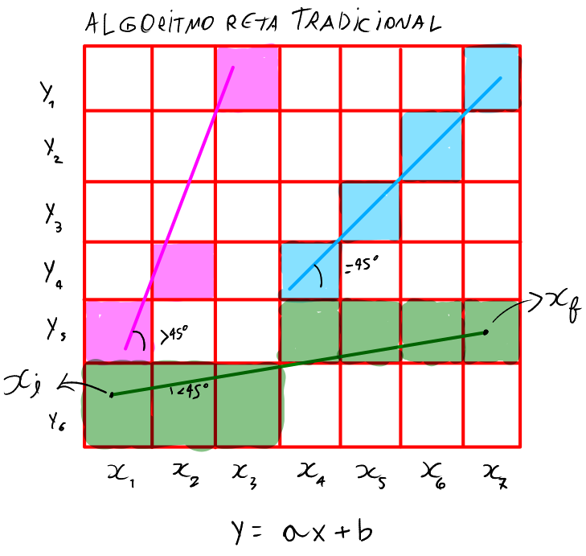
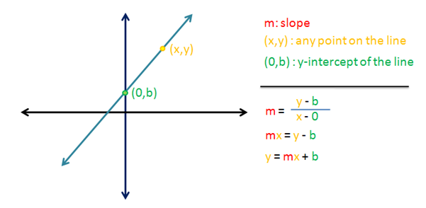
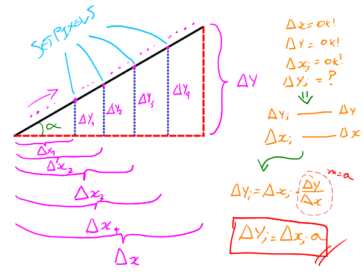
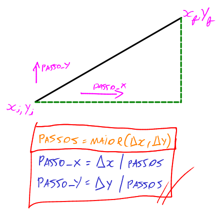
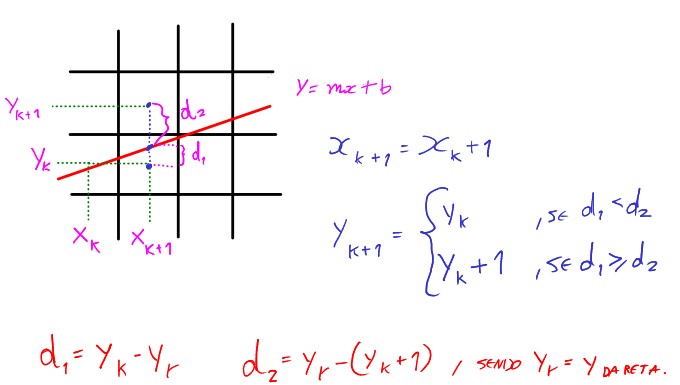
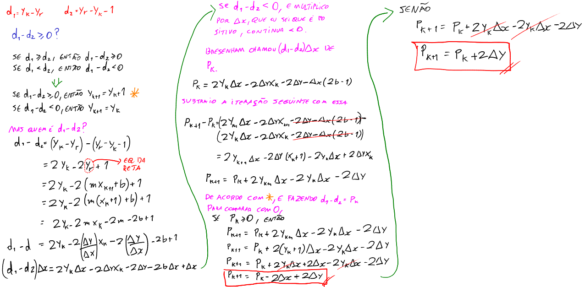

# Links de referência

https://www.lia.ufc.br/~yuri/20231/

# Computação Gráfica

Aqui colocarei os conceitos da computação gráfica.

# Desenhos

Os algoritmos de desenhos são bem básicos e primitivos.

## Algoritmo de Reta Tradicional

O algoritmo itera sobre cada $x$, e produz um setpixel em $y$ para cada $x$. O problema desse algoritmo é que, se o ângulo da reta for maior que $45°$ em relação a $x$, ocorre quebra de pixels. A quebra ocorre porque o pixel já foi setado em $x$, e não há como setar 2 pixels no mesmo $x$, afinal a iteração sobre um único $x$ já foi feita. Para resolver isso, preciso checar se o ângulo é maior que 45°. Se for, itera sobre $y$ e desenha em $x$.

A prova da equação da reta $y = mx + b$ é essa:

A distância entre $x_f$ e $x_i$ é $\Delta x$. E a distância entre $y_f$ e $y_i$ é $\Delta y$. O coeficiente angular é dado por $m = \tan \theta = \frac{\Delta y}{\Delta x}$, e é a partir dele que chegamos na equação da reta (quando $x_i$ é zero, produz o ponto b, que é o que intercepta o eixo das oordenadas).

Só que como eu estou trabalhando com pedaços de reta (segmentos), então não preciso do $b$.

O que eu preciso fazer para desenhar essa reta é usar semelhança de triãngulos. Um triângulo menor será formado para cada iteração, e ele cresce até chegar no $x_f$ e $y_f$. Assim:

Portanto, a cada iteração, faço 1 semelhança de triângulos. Eu conheço $\Delta x$ e $\Delta y$, pois o usuário digita o início e fim da reta com coordenadas $x_{final}, x_{inicial}, y_{final}, y_{inicial}$. Conheço $\Delta x_i$, pois é o meu laço iterando sobre $x$, e quero descobrir o $\Delta y_i$. A fórmula é essa (semelhança de triângulos):

$$\Large \boxed{\Delta y_i = \Delta x_i \cdot a}$$

Com isso, consigo pintar o segmento de reta em diversas iterações com set_pixel.

## Reta DDA

A reta DDA usa passos para percorrer a reta que se deseja desenhar.

É bem mais simples que a reta tradicional, pois como utiliza passos, não existe verificações de casos especiais.

$passo_x$ e $passo_y$ são basicamente porcentagens de quanto vai caminhar em relação a $x$ ou $y$.

A desvantagem desse algoritmo é a quantidade de divisões e pontos flutuantes, o que pode prejudicar no processamento, principalmente quanto se traça milhões de pontos de uma reta na tela.

## Reta Bresenham

A reta Bresenham é um algoritmo que busca eficiência de processamento na hora de fazer a reta, pois não possui operações de divisão, e tem como principal característica a multiplicação por 2, trabalhando melhor com bits.

O conceito por trás da reta é exemplificado na imagem abaixo:

Perceba que os pontos em azul na tela são pontos centrais dos pixels e o ponto em azul na reta é um ponto que define a reta, trivialmente. E os pixels da reta são desenhados com base no quão próximo o $y_r$ (y da reta) está próximo do ponto central de um pixel. Com base nisso, obtenho as fórmulas das distâncias $d_1$ e $d_2$.

E a partir disso, farei os cálculos para achar as fórmulas que Bresenham descobriu que é aplicável ao algoritmo.

