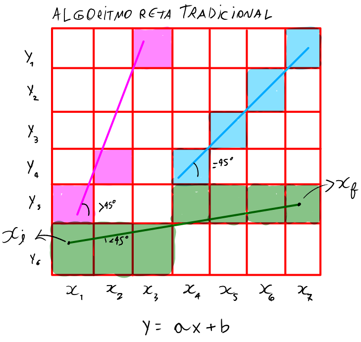
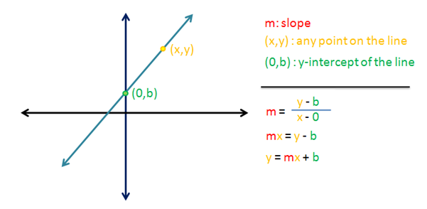
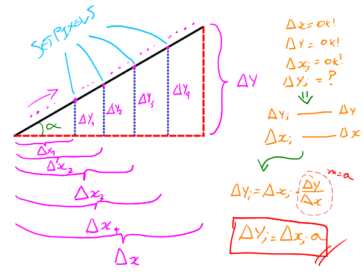
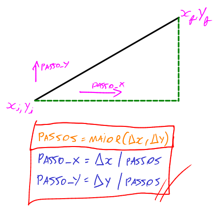
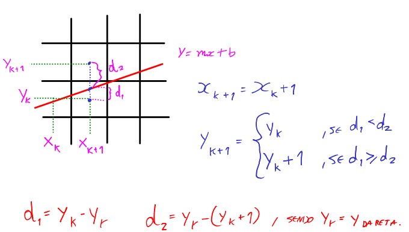
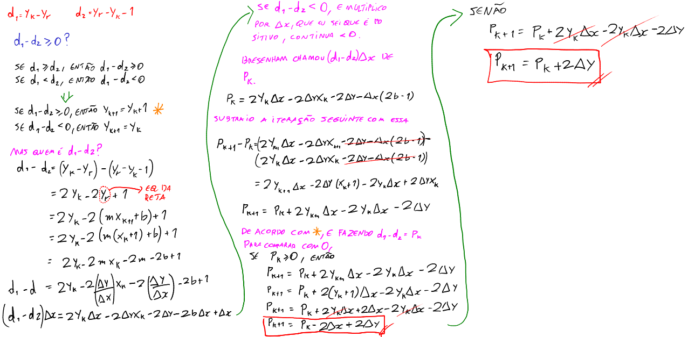
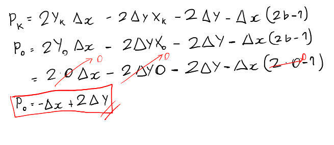
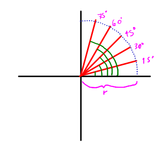

# Links de referência

https://www.lia.ufc.br/~yuri/20231/

# Computação Gráfica

Aqui colocarei os conceitos da computação gráfica.

# Desenhos

Os algoritmos de desenhos são bem básicos e primitivos.

## Algoritmo de Reta Tradicional

O algoritmo itera sobre cada $x$, e produz um setpixel em $y$ para cada $x$. O problema desse algoritmo é que, se o ângulo da reta for maior que $45°$ em relação a $x$, ocorre quebra de pixels. A quebra ocorre porque o pixel já foi setado em $x$, e não há como setar 2 pixels no mesmo $x$, afinal a iteração sobre um único $x$ já foi feita. Para resolver isso, preciso checar se o ângulo é maior que 45°. Se for, itera sobre $y$ e desenha em $x$.

A prova da equação da reta $y = mx + b$ é essa:

A distância entre $x_f$ e $x_i$ é $\Delta x$. E a distância entre $y_f$ e $y_i$ é $\Delta y$. O coeficiente angular é dado por $m = \tan \theta = \frac{\Delta y}{\Delta x}$, e é a partir dele que chegamos na equação da reta (quando $x_i$ é zero, produz o ponto b, que é o que intercepta o eixo das oordenadas).

Só que como eu estou trabalhando com pedaços de reta (segmentos), então não preciso do $b$.

O que eu preciso fazer para desenhar essa reta é usar semelhança de triãngulos. Um triângulo menor será formado para cada iteração, e ele cresce até chegar no $x_f$ e $y_f$. Assim:

Portanto, a cada iteração, faço 1 semelhança de triângulos. Eu conheço $\Delta x$ e $\Delta y$, pois o usuário digita o início e fim da reta com coordenadas $x_{final}, x_{inicial}, y_{final}, y_{inicial}$. Conheço $\Delta x_i$, pois é o meu laço iterando sobre $x$, e quero descobrir o $\Delta y_i$. A fórmula é essa (semelhança de triângulos):

$$\Large \boxed{\Delta y_i = \Delta x_i \cdot a}$$

Com isso, consigo pintar o segmento de reta em diversas iterações com set_pixel.

## Reta DDA

A reta DDA usa passos para percorrer a reta que se deseja desenhar.

É bem mais simples que a reta tradicional, pois como utiliza passos, não existe verificações de casos especiais.

$passo_x$ e $passo_y$ são basicamente porcentagens de quanto vai caminhar em relação a $x$ ou $y$.

A desvantagem desse algoritmo é a quantidade de divisões e pontos flutuantes, o que pode prejudicar no processamento, principalmente quanto se traça milhões de pontos de uma reta na tela.

## Reta Bresenham

A reta Bresenham é um algoritmo que busca eficiência de processamento na hora de fazer a reta, pois não possui operações de divisão, e tem como principal característica a multiplicação por 2, trabalhando melhor com bits.

O conceito por trás da reta é exemplificado na imagem abaixo:

Perceba que os pontos em azul na tela são pontos centrais dos pixels e o ponto em azul na reta é um ponto que define a reta, trivialmente. E os pixels da reta são desenhados com base no quão próximo o $y_r$ (y da reta) está próximo do ponto central de um pixel. Com base nisso, obtenho as fórmulas das distâncias $d_1$ e $d_2$.

E a partir disso, farei os cálculos para achar as fórmulas que Bresenham descobriu que é aplicável ao algoritmo.

Para achar o $P_0$ inicial, basta:

O que me importa aqui é o formato da reta. Não me importa as coordenadas. E por isso posso fazer uma reta partindo da origem. Ou seja, com $b = 0$, e $y_0 = x_0 = 0$.

Portanto, $P$ é o cara que vai decidir se o pixel será pintado mais pra cima ou mais pra baixo, pois é definido como a diferença de distâncias de um centro real de um pixel para outro. Assim, vou incrementando em $x$ e em $y$ (como se fossem passos), e ai vou decidindo a partir do $P$. Na próxima iteração, ficará a cargo de $P$ se é maior, igual ou menor que 0 para saber onde colocar.

## Circunferência e Elipse

O desenho da circunferência, de inicio a se pensar, poderia ser feito definindo um raio $r$, e os passos como sendo cada grau do ângulo.

E como eu quero iterar sobre x (cos) até 45°, eu sempre calculo para cada grau o $\cos 1, \cos 2, ... , \cos 90$, e depois desenho o resto de forma simétrica.

O problema é que dependendo do raio e da resolução da tela, o desenho da circunferência ficará quebrado, pois o arco da circunferência próxima do ponto de origem tem um comprimento menor do que o arco da circunferência mais distante, considerando ambos os arcos com mesmo ângulo. E portanto, pular de 1 em 1 grau teria diferentes comportamento. 1 grau pode resolver para resoluções ou raio baixos, mas 1 grau é muito grande para resoluções ou raio altos, ocasionando em quebra de pixel.

Uma alternativa é o uso de **polígonos circunscritos** na circunferência. Infelizmente como os computadores não computam infinitos, então não podemos fazer o ângulo tender a zero a cada passo, e por isso nunca a circunferência vai ser perfeita. E isso é feito até nos dias de hoje com modelos 3D, e quanto mais vértices o polígono circunscrito tiver, mais pesado ficará o processamento.

Apesar da técnica do polígono circunscrito ser uma técnica muito eficiente para 3D, ela já não faz muito sentido para 2D, já que o custo de processamento de polígonos em áreas 2D são muito menores. Uma alternativa para o 2D é recorrer a equação da circunferência $x^2 + y^2 = raio^2 \implies y = \sqrt{r^2 - x^2}$. O problema dessa equação é que precisaremos fazer para cada quadrante o desenho.

Para a circunferência, é possível utilizar tanto a reta DDA quanto a reta Bresenham, mas a reta Bresenham é mais eficiente, pois evita trabalhar com números flutuantes. Porém, eu particulamente obtive sucesso imediato com a reta DDA, então usarei ela.

Sobre a Elipse, a forma como se faz é muito semelhante, e os métodos de elipse e circunferência estão no arquivo main.py. Na elipse é preciso levar em consideração se o ângulo com que se está trabalhando é maior ou menor que 45°, baseado no tamanho de $a$ e $b$.

## Flood fill

Flood fill é um algoritmo de desenho que preenche até encontrar uma borda. Existe a forma recursiva, que pode estourar a call stack, e a forma iterativa usando pilha na heap, que é mais seguro, mas ainda sim lento.

## Polígonos

Os polígonos nada mais são do que uma figura geométrica de 3 lados no mínimo. Para ligar pontos e fechar um polígono, é preciso pelo menos $n_{lados}+1$ elementos de uma lista que guarda as coordenadas (x,y). Ou seja, é uma matriz de tamanho $(n+1)$ x $(2)$ elementos.