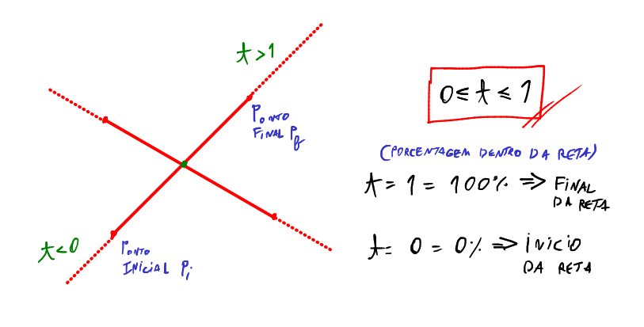
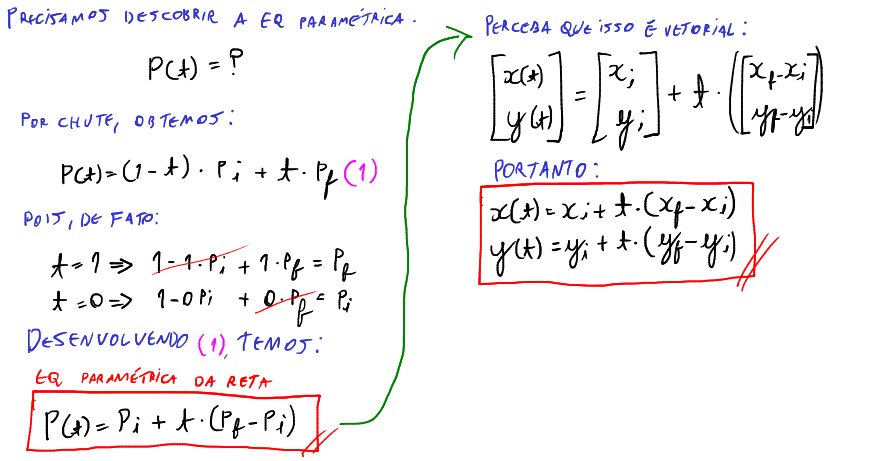

# Scanline - Introdução

O algoritmo de scanline é um algoritmo que propõe ser muito mais eficiente que o flood fill para pintar polígonos. Basicamente ele varre linha por linha e sai pintando um polígono, sabendo as coordenadas do polígono. O flood fill é bom quando não temos informações de borda, pois ele sai pintando até encontrar alguma borda por conta própria. Sabendo das informações da borda de um polígono, não há motivos para usar flood fill, pois só é aumento de custo computacional para verificações. Usamos o scanline.

Sabendo a coordenada em y, ele varre x e pinta em retas, utilizando-se de apenas um laço e evitando comparar se o pixel já foi pintado e evitar o uso de desempilhamento e empilhamento.

O algoritmo de scanline é o algoritmo utilizado para pintar a maioria dos polígonos no computador, inclusive de projeções 2D a partir de mundos 3D (jogos). Portanto, para geração de imagens, o scanline é amplamente utilizado e definitivo. O flood fill serve mais para processamento de imagens ou edição em editores de imagens.

# Interseção

Antes de entrar na parte de Scanline, precisamos entender como funciona a interseção de uma reta com outra. Afinal, quando o scanline traça as retas, ela precisa interseccionar com a reta do polígono para saber onde ele deve pintar e onde ele deve parar.

Adotamos então um parâmetro $t$, que é basicamente uma porcentagem que um determinado ponto está no segmento de reta.

## Equação Paramétrica da Reta

A equação paramétrica da reta é basicamente uma função que te retorna um ponto $(x, y)$ ao passar o parâmetro t.

Para isso, baseado na figura anterior, precisamos descobrir para cada reta qual sua equação $P(t)$:

Esse chute de equação inicial é o que precisamos para achar que se $t = 1$, implica achar o ponto final do segmento, e se t = 0, implica achar o ponto inicial do segmento. Portanto, podemos trabalhar com porcentagens a partir disso.