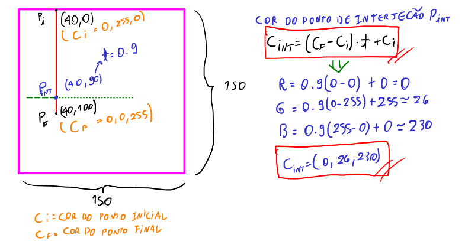
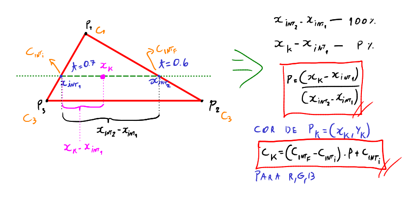
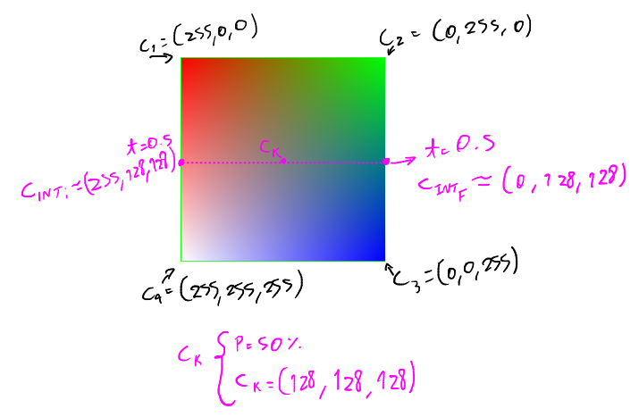
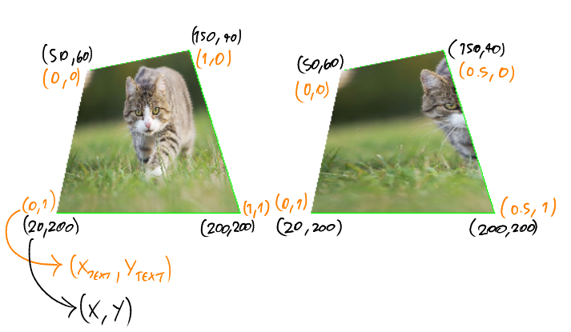

# Scanline - Introdução

O algoritmo de scanline é um algoritmo que propõe ser muito mais eficiente que o flood fill para pintar polígonos. Basicamente ele varre linha por linha e sai pintando um polígono, sabendo as coordenadas do polígono. O flood fill é bom quando não temos informações de borda, pois ele sai pintando até encontrar alguma borda por conta própria. Sabendo das informações da borda de um polígono, não há motivos para usar flood fill, pois só é aumento de custo computacional para verificações. Usamos o scanline.

Sabendo a coordenada em y, ele varre x e pinta em retas, utilizando-se de apenas um laço e evitando comparar se o pixel já foi pintado e evitar o uso de desempilhamento e empilhamento.

O algoritmo de scanline é o algoritmo utilizado para pintar a maioria dos polígonos no computador, inclusive de projeções 2D a partir de mundos 3D (jogos). Portanto, para geração de imagens, o scanline é amplamente utilizado e definitivo. O flood fill serve mais para processamento de imagens ou edição em editores de imagens.

# Interseção

Antes de entrar na parte de Scanline, precisamos entender como funciona a interseção de uma reta com outra. Afinal, quando o scanline traça as retas, ela precisa interseccionar com a reta do polígono para saber onde ele deve pintar e onde ele deve parar.

Adotamos então um parâmetro $t$, que é basicamente uma porcentagem que um determinado ponto está no segmento de reta.

## Equação Paramétrica da Reta

A equação paramétrica da reta é basicamente uma função que te retorna um ponto $(x, y)$ ao passar o parâmetro t.

Para isso, baseado na figura anterior, precisamos descobrir para cada reta qual sua equação $P(t)$:

Esse chute de equação inicial é o que precisamos para achar que se $t = 1$, implica achar o ponto final do segmento, e se $t = 0$, implica achar o ponto inicial do segmento. Portanto, podemos trabalhar com porcentagens a partir disso.

Agora suponha uma inserseção:

Perceba que eu tenho todos os valores de y, que é a reta da scanline, pois eu sei a altura que ela está iterando na tela. Ou seja, para toda reta da scanline, eu sei o ponto y que intersecta com a reta do polígono. Ou seja, eu preciso descobrir $\forall y$, um $x \in (x, y)$, onde y é um valor que já sei.

Agora vamos para os casos de exceção:

Veja, um problema ocorre ao interseccionar a scanline sobre um vértice. Se o ponto final de uma reta coincidir com uma inicial de outra reta, a scanline também faz pintura 2 a 2 interseções. O problema é que isso independe do caso, e um triângulo na horizontal também sofrerá disso. Para resolver o problema, usamos a seguinte artimanha: a interseção passa a ignorar agora quando $t = 0$, ou seja, se interseccionar um vértice inicial de alguma reta, ele para de fazer 2 a 2 nesse caso do triângulo horizontal, e será feita a scanline normalmente. Porém,  na figura da montanha, terá o problema de não desenhar tudo. Como resolver isso? Assim:

O que eu fiz aqui? Basicamente eu ignorei a interseção quando t for zero, que é quando a scanline passa por algum vértice inicial. Porém, isso quebra a outra exceção, que já estava bonitinha funcionando. Então para resolver de vez o problema, no próprio algoritmo de interseção, invertemos os valores $P_f$ e $P_i$ quando a construção da aresta do polígono for feita de baixo pra cima. Quando for de cima pra baixo, faz nada. Assim resolvemos o problema, pois sempre que tiver dois vértices coincidindo e a scanline precisa pintar horizontalmente, ela vai pintar sempre em 2 pontos finais, o que é perfeito para fazer pinturas em interseções 2 a 2.

E sim, quando inverte $P_f$ com $P_i$, basicamente se eu tiver um $t = 0.3$ (30% da reta), ele passa a ser $t = 0.7$ (70% da reta).

# Scanline

O algoritmo de scanline basicamente pega as interseções descobertas entre a linha de scanline e a aresta de um polígono, e de 2 em 2 ele pinta entre interseções, como já mostrado. Sempre quando for fazer as inteseções, é preciso analisar, para cada y de scanline, quais arestas do polígono na estrutura de dados do polígono intersectam com a linha da scanline. Para analisar cada aresta, sempre percorremos em sentido horário as arestas do polígono. Para percorrer, basta guardar as informações do ponto inicial e final de cada aresta, e sempre a aresta subsequente terá o ponto inicial igual o ponto final da aresta anterior. Feito isso, pintamos a scanline.

Além disso, para garantir que possamos guardar o x das interseções (pois já sabemos o y), usamos uma estrutura de dados simples. Essa estrutura é fundamental para que possamos pular de 2 em 2 interseções. E o mais importante: essa estrutura precisa estar ordenada de forma crescente! Assim evita cortes de preenchimento do polígono dependendo da ordem com que os vértices do polígono foram definidos na estrutura de dados do polígono.

# Scanline com interpolação de cores

Quando se aplica cores em degradê em um polígono, em qualquer software, se utiliza a seguinte definição: todo vértice tem uma cor atribuída.

Portanto, se eu tenho um quadrado, 

O algoritmo que interpola cores em degradê é mais complexo, mas basicamente ele usa muito do "t" como parâmetro para saber em quantos % tal cor deve ser atribuida a um vértice de interseção.

Quadrado rosa = tela.

Perceba que também preciso dar nome aos bois. Ou seja, pra cada interseção, tem que haver uma cor correspondente. O cálculo é pela fórmula

$$\Large\boxed{c_{intersecao} = (c_f - c_i)t + c_i}$$

E assim aplico essa fórmula para cada canal RGB. Essa fórmula nada mais é que a fórmula de porcentagem aplicada. Para cada varredura pintada terei um $t$ diferente interseccionando, e portanto uma variação de cor contínua de um vértice inicial para um final.

Porém o que interessa pra gente não é pintar os vértices, e sim dentro do polígono. Para isso precisamos novamente mexer com porcentagens, dessa vez pegando as informações de cores dos pontos de interseção, e ver: entre uma interseção na esquerda e outra na direita, quanto devo variar a cor? Aplico a mesma lógica do ponto inicial e final da aresta, dessa vez só troca os nomes: de uma interseção para outra.

O resultado é esse aqui:

# Scanline com textura

Quando se trata de scanline com textura, normalmente atribuimos aos vértices de um polígono, as coordenadas de textura que será preenchida naquele polígono, em porcentagem (de 0 a 1). As texturas são aplicadas em um polígono de 4 vértices, afinal uma imagem é uma matriz, e matriz sempre é retangular. Por convenção, atribuímos para cada vértice, (0,0), (1,0), (1,1) e (0, 1) (sentido horário de criação do polígono).

Assim usamos esses valores para finalmente preencher o polígono com a textura. Pra isso é preciso na scanline fazer interseções e ver quais pontos de interseção existem. E assim, entre uma interseção e outra, vejo quais são os pontos do polígono para cada desenho da scanline qeu é equivalente em porcentagem ao que está na textura. Descoberto isso, faço get_pixel da textura e jogo no ponto do polígono onde no momento está fazendo a varredura.

Se quebrarmos um pouco a convenção de 0 a 1, obtemos esse resultado:

Esquerda: convenção. Direita: se colocarmos 50% da textura em x para cada vértice do polígono do lado direito.