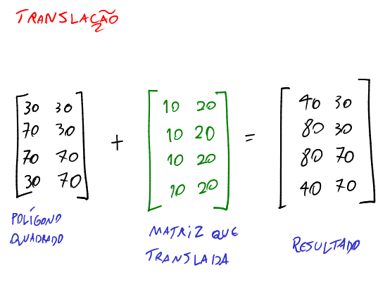

# Trasfomrações Lineares: Translação, Escala e Rotação

A forma como mudamos os dados de uma lista de polígonos 2D é através de manipulação de matrizes. Normalmente se várias alterações são feitas em sequência, essa sequência precisa ser preservada de tal forma que se ela for feita de forma alterada na próxima alteração, gerará uma figura completamente diferente. Isso é a essência da transformação linear e de que a ordem da multiplicação de matrizes importa.

# Translação

A ideia de translação é, dada um polígono que obviamente tem uma lista de vértices, se eu disser as coordenadas para onde esse polígono deve ir, então eu devo somar essas coordenadas com todos as coordenadas da lista de vértices. Assim:

Porém, não é muito conveniente ficar trabalhando com soma de matrizes quando se trata de sucessivas transformações lineares. Portanto é interessante passarmos essa operação para um produto de matrizes, pois simplifica o cálculo.

# Escala

Em escala, a matriz de transformação muda um pouco. No caso como estamos aplicando uma escala, precisaremos, de forma proporcional, aumentar o tamanho de cada coordenada dos vértices. Como assim?

Se eu aplico uma escala em x, todos os x dos vértices do polígono sofrerão alterações, e o mesmo vale somente para o y. Se eu faço uma escala nos dois, então os dois sofrerão alterações.

E perceba que há uma translação como consequência. E isso é inevitável na escala. Existem algoritmos que tratam desse problema, mas não serão abordados agora.

A matriz de transformação para escala é essa:

# Rotação

Para descobrir os parâmetros para rotacionar um polígono é um pouco mais complicado, e será melhor demonstrado nessa imagem:

Perceba que essa matriz foi montada com base em um sistema linear clássico, assim como as outras matrizes.

Para evitar que a rotação seja em torno da origem, mas sim em torno de seu próprio eixo, simplesmente fazemos a translação do polígono para a origem da tela, rotacionamos, e depois devolvemos para a posição original.

# Acúmulo

O acúmulo é quando se aplica transformações sucessivas em uma matriz de transformação inicialmente identidade.

Para acumular transformações, basta multiplicarmos as matrizes de transformações e ir guardando em uma variável. Assim:

$$\Large M_{acumulo} = M_{rotacao} \cdot M_{translacao} \cdot M_{rotacao} \cdot M_{escala} \cdot M_{translacao}$$

Depois aplica todo esse acúmulo em cada vértice do polígono na lista de vértices.

Perceba que a matriz translação não interfere em nada quando multiplicada pela matriz de rotação ou escala, justamente porque os valores $tx$ e $ty$ ficam do lado direito da matriz identidade. E já a rotação e a escala podem conflitar, ou seja, a ordem em que elas são feitas importa e muito.

Exemplos:
- A seguinte afirmação é válida: translação -> rotação = rotação -> translação. O resultado final produzido será o mesmo.
- A seguinte afirmação é inválida: escala -> rotação = rotação -> escala. O resultado final produzido para os dois lados da igualdade na verdade são distintos.
    - Isso matematicamente é explicado pelo conflito nos valores matriciais.
    - Mas não é difícil imaginar num plano isso ocorrendo: se eu fizer a escala primeiro e depois rotacionar, eu tenho um resultado aparentemente normal. Porém, se eu rotacionar e depois aplicar a escala, o polígono irá se distorcer, pois a posição dos vértices estarão completamente diferentes, fazendo com que a escala não seja proporcional para as coordenadas tal qual seria antes.
