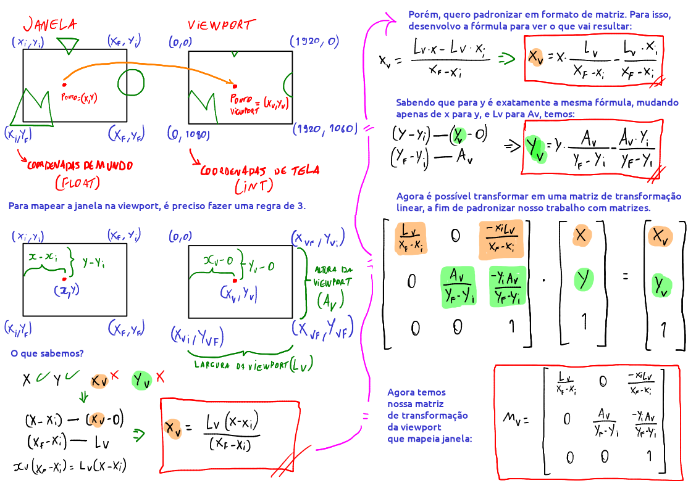
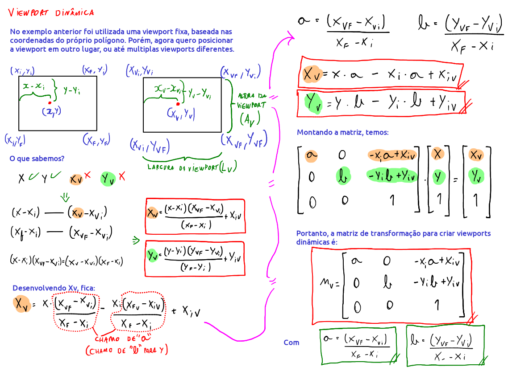

# Janela e Viewport

A **janela** é um recorte do mundo. Ou seja, ela possui coordenadas infinitas de mundo, e o que estiver dentro dela é mapeado e renderizado. A representação dessa renderização é feita em uma **viewport**, que possui coordenadas de tela. Tanto a viewport quanto a janela possuem tamanhos dinâmicos, e podem ser diferentes. Uma janela pode ser mapeada em múltiplas distintas viewports, mas não o contrário. Múltiplas janelas podem mapear para diferentes viewports também, contanto que não exista duas janelas para uma mesma viewport. É uma relação de 1:N.

As coordenadas de mundo e de tela normalmente são conhecidas, mas as coordenadas de onde será a "projeção" do pixel na viewport não, pois uma viewport pode ser simplesmente uma resolução 200x200, enquanto que as coordenadas da janela é 10000 x 10000, e aí tudo que está em coordenada de mundo precisa ser mapeado para a viewport de tal forma que caiba nos 200x200 pixels.

As coordenadas de mundo são representadas por valores em float, pois se trabalha com coordenadas de mundo, e as coordenadas da viewport são representadas em int, pois se trabalha com pixels, ou coordenadas de tela.

Como eu sei tudo sobre a janela, o tamanho da viewport, e eu só preciso saber como vou maepar as coordenadas de mundo em tela para cada pixel na viewport que representa tal região da janela, preciso desenvolver uma fórmula que ache essas coordenadas. Nada melhor do que uma regra de três simples:

E portanto, sabemos agora a matriz de transformação da viewport que mapeia uma janela.

Como usar essa matriz? Aplica uma transformação linear para cada vértice do polígono. Ou seja, aplica o produto em cada $[x, y, 1]$ da lista de vértices do polígono. Portanto terei um polígono novo transformado que caberá na viewport de forma proporcional baseado no que foi capturado na janela. Se eu quero fazer um recorte em todos os objetos dentro da janela, terei que fazer essa transformação linear para TODOS os objetos, e depois desenhar na tela os objetos transformados.

Uma observação importante: um tamanho de janela 500x500 e viewport 500x500 basicamente fará com que a viewport represente esse recorte da janela de forma fidedigna, sem distorções, sendo uma proporção 1:1.

> Nota: o uso da palavra "projeção" para representações 2D é incorreto, pois a projeção na verdade ocorre com câmeras, que serão abordadas nos tópicos sobre mundo em 3 dimensões. O conceito de janela em 2D está para a câmera em 3D, portanto são muito similares: é um recorte do mundo. Usei a palavra apenas de forma intuitiva.
 
Para criar viewports múltiplas e dinâmicas posicionadas em qualquer lugar da tela, precisamos expandir o vetor da viewport para incluir as coordenadas iniciais.

